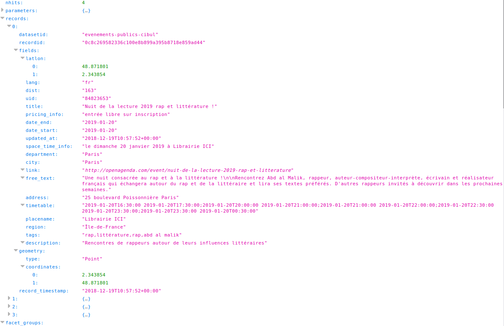

Jeudi, 27. décembre 2018 02:33
**For any information contact Ghania BARA**

# Event API
This documentation describes how to use event API.
The purpose of its API is to list all public events happening around a circle of a given distance.
It concerns either current events from the current day of the request/search either upcoming ones in a fortnight.

### Description
Event API to broadcast a streaming transmission of public events wich take place in a specific area.
Event  API is embedded in software  implemented in C++ programing language and consequently allows to list all public events taking place in the current geographical location for a period of time.
API result are continously display on a screen when C++ program is launched.

### Functional presentation
Event API calls a webservice which requests a network server in order to gather expected events. 

### Type of events
Event API enables to search different type of events:
 - Concerts
 - Sport events
 - Drama 
 - Lectures
 - Exhibition
 - Show 
 - Demonstration
 - Competition
 - Meeting
 - Art

  There is no filter on event type but they are filtered by current date +15 days.

### Place of event
The place of the event is calculated through a geo-location provided by the user who sets up:
 - longitude position
 - lattitude position
 - radius: scope of distance based on a number of meters
These 3 parameters (latitude, longitude, distance) define a geographical area.

## Technical presentation
### Network server (URL)
Network server is fed by OpenData's government which broadcasts all event data through dedicated APIs: satellites, museums, trains...
Main address is available through this specific URL: 
https://public.opendatasoft.com/explore/dataset/evenements-publics-cibul/api/?disjunctive.tags&disjunctive.placename&disjunctive.city&rows=20&geofilter.distance=&location=2,20.65089,6.15314&basemap=mapquest

## JSON
API communicates data between a network browser and a server in text format using JSON syntax.
JSON stands for **J**ava**S**cript **O**bject **N**otation.
It s a lightweight data-interchange format in text only.
Text is read and used as a data format by C++ (programming language).
### INPUT

Network request:
https://public.opendatasoft.com/api/records/1.0/search/?dataset=evenements-publics-cibul&rows=20&facet=tags&facet=placename&facet=department&facet=region&facet=city&facet=date_start&facet=date_end&facet=pricing_info&facet=updated_at&facet=city_district&refine.date_start=2019-01&geofilter.distance=48.871517%2C+2.346051%2C+5000
    

### OUTPUT

