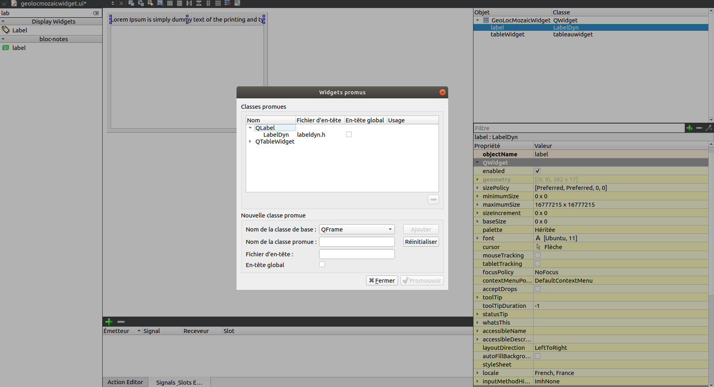
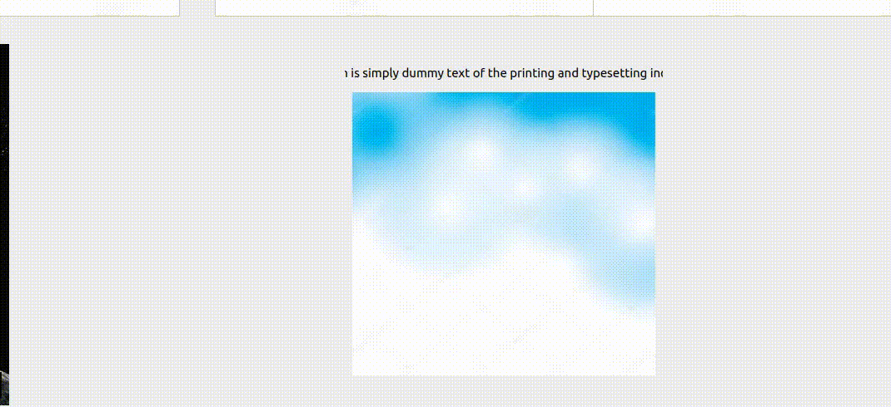

## LabelDyn
La classe LabelDyn hérite de QLabel et permet le défilement d'un texte trop long contenu dans un label.
L'utilisation est exactement la meme qu'un QLabel, voici 2 exemples d'utilisations.

## ***Exemple 1***
#### A partir de l'UI.
Vous pouvez declarer un QLabel dans votre UI et le promouvoir en LabelDyn.
Vous devrez avoir un résultat similaire à l'image.



## ***Exemple 2***
#### Dans votre fichier.cpp
Vous pouvez tout simplement le déclarer dans votre code en dur. 
Le comportement et et les méthodes de cette classe sont ensuite identique au QLabel.
```cpp
//this correspond au QWidget parent.
LabelDyn *label = new LabelDyn(this);
```
#### <span style="color: green">**Resultat**


