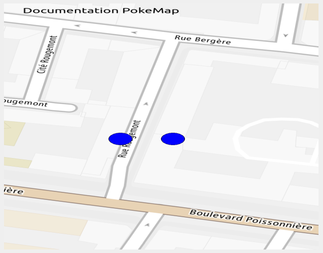

## PokeMap
La classe PokeMap retourne une pixmap avec une carte géographique remplie de marqueurs et de textes.
Les cartes sont générés lors de la configuration de Geostation.

## <span style="color: blue">Constructeur</span>
```cpp
PokeMap(MAP index);
```
Le constructeur prend en paramétre une valeur de l'énumération [**MAP**](#map)

## <span style="color: orange">Méthodes</span>
```cpp
void        PokeMap::addPoint(QString latitude, QString longitude);
```
Permet l'ajout d'un point sur la pixmap grace aux coordonnées fournis.
```cpp
void        PokeMap::addText(int x, int y, QString text);
```
Permet l'ajout de texte aux coordonnées x et y de la pixmap.
```cpp
QPixmap     PokeMap::pixmap();
```
Renvoie une pixmap de la carte choisie avec tous les marqueurs et textes ajoutés.
## <span id="map"> Enumération </span>
```cpp
enum        MAP{CENT_M, DEUX_CENT_M, CINQ_CENT_M, MILLE_M, MILLE_CINQ_CENT_M, CINQ_MILLE_M, TROIS_CENT_KM, HUIT_CENT_KM};
```
Les différents index correspondent au maps générés à l'aide d'un point et d'un rayon (en mètres) par défaut lors de l'installation de Geostation.

## Exemple d'utilisation
```cpp
QPixmap resultat;
PokeMap *carte = new PokeMap(PokeMap::CENT_M); // CENT_M correspond à la carte de rayon 100 mètres.
	
//Ajoute les différents points sur la carte
carte->addPoint("48.871554", "2.346000");
carte->addPoint("48.871554", "2.346300");
	
//Ajoute du texte sur la carte au coordonnées x, y de la pixmap
carte->addText(100, 200, "Documentation PokeMap");
	
resultat = carte->pixmap(); // Retourne la carte final;
```
La pixmap obtenue est la suivante :



Le résultat dépend de la carte choisie et les cartes elle-memes dépendent de la longitude et de la latitude choisie lors de l'installation de Geostation.
